# Estructura del Proyecto `charmss-customer`

Este documento detalla la estructura de directorios y archivos del proyecto `charmss-customer`, una aplicación ReactJS con TypeScript, diseñada con una arquitectura limpia para ser escalable, modular y mantenible.

## Diagrama de Estructura (PlantUML)

```plantuml
@startuml

skinparam folder {
    BackgroundColor #222222
    BorderColor #66CCFF
    FontColor White
}

skinparam file {
    BackgroundColor #444444
    BorderColor #99FF99
    FontColor White
}

folder "charmss-customer" as root {
    folder "public" as public {
        file "index.html"
        file "manifest.json"
        file "service-worker.js"
        file "vite.svg"
    }

    folder "src" as src {
        folder "assets" as assets {
            folder "images" as images {
                file ".gitkeep"
            }
            folder "icons" as icons {
                file ".gitkeep"
            }
            file "react.svg"
        }

        folder "components" as components {
            folder "common"
            folder "layout"
            folder "specific"
        }

        folder "config"
        folder "hooks"

        folder "layouts" as layouts {
            file "AuthLayout.tsx"
            file "MainLayout.tsx"
        }

        folder "pages" as pages {
            folder "auth" as auth_pages {
                file "LoginPage.tsx"
                file "RegisterPage.tsx"
            }
            folder "home" as home_pages {
                file "HomePage.tsx"
            }
            folder "profile" as profile_pages {
                file "ProfilePage.tsx"
            }
        }

        folder "services" as services {
            folder "api" as api_services {
                file "axiosInstance.ts"
            }
            folder "auth"
        }

        folder "store"

        folder "styles" as styles {
            file "index.css"
        }

        folder "types"
        folder "utils"

        file "App.tsx"
        file "main.tsx"
        file "routes.tsx"
        file "App.css"
        file "vite-env.d.ts"
    }

    folder "docs" as docs {
        file "PROJECT_STRUCTURE.md"
    }

    folder "node_modules"
    folder "dist"

    file ".env"
    file ".gitignore"
    file "package.json"
    file "package-lock.json"
    file "tsconfig.json"
    file "tsconfig.app.json"
    file "tsconfig.node.json"
    file "vite.config.ts"
    file "README.md"
    file "eslint.config.js"
}
@enduml
```



## Árbol de Directorios

```
charmss-customer/
├── public/                 # Archivos estáticos públicos
│   ├── manifest.json       # Manifiesto de la aplicación web (PWA)
│   ├── service-worker.js   # Archivo para el Service Worker (PWA)
│   └── index.html          # Plantilla HTML principal
├── src/
│   ├── assets/             # Recursos estáticos de la aplicación
│   │   ├── images/         # Imágenes (logos, iconos, fondos, etc.)
│   │   │   └── .gitkeep    # Archivo para mantener la carpeta en Git
│   │   ├── icons/          # Iconos SVG o PNG
│   │   │   └── .gitkeep    # Archivo para mantener la carpeta en Git
│   │   └── ...
│   ├── components/         # Componentes React reutilizables
│   │   ├── common/         # Componentes genéricos y de alta reutilización (ej. Button, Input, Modal)
│   │   ├── layout/         # Componentes de estructura de página (ej. Header, Footer, Sidebar)
│   │   └── specific/       # Componentes específicos de una funcionalidad o sección (ej. UserCard, PostFeed)
│   ├── config/             # Configuraciones globales de la aplicación
│   ├── hooks/              # Hooks personalizados de React para lógica reutilizable y encapsulada
│   ├── layouts/            # Componentes de layout para diferentes secciones de la aplicación
│   │   ├── AuthLayout.tsx  # Layout para páginas de autenticación
│   │   └── MainLayout.tsx  # Layout principal de la aplicación
│   ├── pages/              # Componentes de nivel superior que representan las vistas/rutas principales
│   │   ├── auth/           # Páginas relacionadas con la autenticación
│   │   │   ├── LoginPage.tsx
│   │   │   └── RegisterPage.tsx
│   │   ├── home/           # Página principal/feed
│   │   │   └── HomePage.tsx
│   │   └── profile/        # Páginas de perfil de usuario
│   │       └── ProfilePage.tsx
│   ├── services/           # Capa de infraestructura: Lógica para interactuar con APIs externas y servicios
│   │   ├── api/            # Instancias de Axios y funciones cliente para las APIs
│   │   │   └── axiosInstance.ts # Instancia de Axios con interceptores
│   │   └── auth/           # Lógica de autenticación (ej. manejo de tokens, funciones de login/logout)
│   ├── store/              # Gestión de estado global con Zustand
│   ├── styles/             # Archivos de estilos globales y configuración de Tailwind CSS
│   │   └── index.css       # Archivo principal para las directivas de Tailwind y estilos base
│   ├── types/              # Definiciones de tipos TypeScript (interfaces, enums, tipos personalizados)
│   ├── utils/              # Funciones de utilidad genéricas
│   ├── App.tsx             # Componente principal de la aplicación
│   ├── main.tsx            # Punto de entrada de la aplicación React
│   └── routes.tsx          # Definición centralizada de las rutas de la aplicación con React Router
├── docs/                   # Documentación del proyecto
│   └── PROJECT_STRUCTURE.md # Este documento
├── node_modules/           # Dependencias del proyecto instaladas por npm
├── dist/                   # Archivos de salida para producción
├── .env                    # Variables de entorno
├── .gitignore              # Archivos y directorios ignorados por Git
├── package.json            # Metadatos del proyecto y dependencias
├── tsconfig.json           # Configuración de TypeScript
├── vite.config.ts          # Configuración de Vite
└── README.md               # Documentación general del proyecto
```

## Propósito y Tareas de Cada Carpeta/Archivo

### `public/`

*   **Propósito**: Contiene los archivos estáticos que se sirven directamente al navegador sin ser procesados por el bundler (Vite). Es ideal para el `index.html`, el manifiesto de la PWA y el Service Worker.
*   **Tareas Correspondientes**:
    *   `manifest.json`: Definir la configuración de la PWA (nombre, iconos, colores, etc.).
    *   `service-worker.js`: Implementar la lógica de caché, notificaciones push y otras funcionalidades offline para la PWA.
    *   `index.html`: Servir como la plantilla HTML principal donde se monta la aplicación React.

### `src/`

*   **Propósito**: Contiene todo el código fuente de la aplicación React.

#### `src/assets/`

*   **Propósito**: Almacenar todos los recursos estáticos que no son código, como imágenes, iconos, fuentes, videos, etc.
*   **Tareas Correspondientes**:
    *   `images/`: Guardar imágenes específicas de la aplicación.
    *   `icons/`: Almacenar iconos utilizados en la interfaz de usuario.
    *   `.gitkeep`: Asegurar que las carpetas vacías sean incluidas en el control de versiones.

#### `src/components/`

*   **Propósito**: Contener componentes React reutilizables, siguiendo una convención de atomic design o similar para una mejor organización.
*   **Tareas Correspondientes**:
    *   `common/`: Desarrollar componentes UI genéricos y de alta reutilización (ej. `Button.tsx`, `Input.tsx`, `Modal.tsx`).
    *   `layout/`: Crear componentes que definen la estructura visual de las páginas (ej. `Header.tsx`, `Footer.tsx`, `Sidebar.tsx`).
    *   `specific/`: Implementar componentes que son específicos de una funcionalidad o sección particular de la aplicación (ej. `UserCard.tsx`, `PostFeed.tsx`).

#### `src/config/`

*   **Propósito**: Almacenar configuraciones globales de la aplicación, como variables de entorno, constantes, o configuraciones de servicios externos.
*   **Tareas Correspondientes**:
    *   Definir constantes de la aplicación.
    *   Configurar variables de entorno que no sean sensibles.

#### `src/hooks/`

*   **Propósito**: Contener hooks personalizados de React para encapsular lógica reutilizable y compleja, haciéndola accesible a través de diferentes componentes.
*   **Tareas Correspondientes**:
    *   Crear hooks para la gestión de estado local complejo.
    *   Desarrollar hooks para la interacción con APIs o servicios específicos.
    *   Implementar hooks para la manipulación del DOM o eventos.

#### `src/layouts/`

*   **Propósito**: Definir las estructuras de diseño principales que se aplican a grupos de páginas, proporcionando una consistencia visual y funcional.
*   **Tareas Correspondientes**:
    *   `AuthLayout.tsx`: Crear un layout específico para las páginas de autenticación (login, registro). Contiene un `<Outlet />` para renderizar las rutas hijas.
    *   `MainLayout.tsx`: Desarrollar el layout principal de la aplicación (con navegación, cabecera, pie de página). Contiene un `<Outlet />` para renderizar las rutas hijas.

#### `src/pages/`

*   **Propósito**: Contener los componentes de nivel superior que representan las diferentes vistas o "páginas" de la aplicación, que se mapean directamente a las rutas.
*   **Tareas Correspondientes**:
    *   `auth/`: Implementar las páginas de autenticación.
        *   `LoginPage.tsx`: Componente para la página de inicio de sesión.
        *   `RegisterPage.tsx`: Componente para la página de registro de nuevos usuarios.
    *   `home/`: Desarrollar la página principal de la aplicación.
        *   `HomePage.tsx`: Componente para el feed principal o la página de inicio.
    *   `profile/`: Crear las páginas de perfil de usuario.
        *   `ProfilePage.tsx`: Componente para la visualización y edición del perfil de usuario.

#### `src/services/`

*   **Propósito**: Encapsular la lógica para interactuar con APIs externas y otros servicios, separando la lógica de negocio de la lógica de presentación.
*   **Tareas Correspondientes**:
    *   `api/`:
        *   `axiosInstance.ts`: Configurar la instancia de Axios con la URL base, timeouts e **interceptores** para manejar tokens de autenticación, errores globales, etc. Este archivo centraliza la configuración de Axios para toda la aplicación.
        *   `authApi.ts`, `userApi.ts`, etc.: Definir funciones específicas para las llamadas a los diferentes endpoints de la API relacionados con autenticación, usuarios, etc., utilizando `axiosInstance.ts`.
    *   `auth/`: Implementar la lógica de autenticación, como el manejo de tokens, funciones de login/logout, y persistencia de sesión.

#### `src/store/`

*   **Propósito**: Gestionar el estado global de la aplicación utilizando Zustand, proporcionando un acceso centralizado y reactivo a los datos.
*   **Tareas Correspondientes**:
    *   `authStore.ts`: Crear un store para el estado de autenticación (usuario logueado, token, etc.).
    *   `userStore.ts`: Desarrollar un store para la información del usuario actual.
    *   Crear stores adicionales según las necesidades de estado global de la aplicación.

#### `src/styles/`

*   **Propósito**: Contener los archivos CSS globales y la configuración de Tailwind CSS.
*   **Tareas Correspondientes**:
    *   `index.css`: Importar las directivas de Tailwind CSS y definir estilos base o globales que no se manejen directamente con Tailwind.

#### `src/types/`

*   **Propósito**: Definir todas las interfaces, tipos y enums de TypeScript que se utilizan en la aplicación, promoviendo la consistencia y la seguridad de tipos.
*   **Tareas Correspondientes**:
    *   `auth.d.ts`: Definir tipos relacionados con la autenticación (ej. `UserCredentials`, `AuthResponse`).
    *   `user.d.ts`: Definir tipos para los objetos de usuario (ej. `User`, `UserProfile`).
    *   Crear archivos de definición de tipos para cada entidad o módulo importante de la aplicación.

#### `src/utils/`

*   **Propósito**: Almacenar funciones de utilidad genéricas que no pertenecen a ninguna capa específica de la aplicación.
*   **Tareas Correspondientes**:
    *   `helpers.ts`: Implementar funciones auxiliares de uso general (ej. formateadores de fechas, manipuladores de cadenas).
    *   `validators.ts`: Desarrollar funciones para la validación de datos de formularios o entradas de usuario.

#### `src/App.tsx`

*   **Propósito**: El componente raíz de la aplicación. Aquí se suelen configurar los proveedores de contexto globales y se renderizan las rutas principales.
*   **Tareas Correspondientes**:
    *   Configurar `React.Context` o `Zustand` providers si es necesario.
    *   Renderizar el componente `AppRoutes`.

#### `src/main.tsx`

*   **Propósito**: El punto de entrada de la aplicación React. Es donde se monta el componente principal en el DOM.
*   **Tareas Correspondientes**:
    *   Renderizar el componente `AppRoutes` dentro de `StrictMode`.
    *   Importar los estilos globales.

#### `src/routes.tsx`

*   **Propósito**: Centralizar la definición de todas las rutas de la aplicación utilizando React Router, lo que facilita la gestión y el mantenimiento de la navegación.
*   **Tareas Correspondientes**:
    *   Definir todas las rutas de la aplicación, mapeando URLs a componentes de página.
    *   Configurar rutas anidadas y rutas protegidas utilizando componentes como `ProtectedRoute`.

### Archivos de Configuración Raíz

*   `.env`: Contiene variables de entorno sensibles o específicas del entorno (ej. `VITE_API_BASE_URL`).
*   `.gitignore`: Especifica los archivos y directorios que Git debe ignorar.
*   `package.json`: Metadatos del proyecto, scripts de npm y lista de dependencias.
*   `tsconfig.json`: Configuración del compilador de TypeScript para el proyecto.
*   `vite.config.ts`: Configuración del bundler Vite, incluyendo plugins y opciones de construcción.
*   `node_modules/`:
    *   **Propósito**: Contiene todas las dependencias de terceros que el proyecto necesita para funcionar, instaladas por el gestor de paquetes (npm).
    *   **Tareas Correspondientes**: No se manipula directamente. Se gestiona automáticamente con `npm install`, `npm update`, etc.
*   `dist/`:
    *   **Propósito**: Es el directorio de salida donde Vite coloca los archivos optimizados y listos para producción (HTML, CSS, JavaScript, assets) después de ejecutar el comando `npm run build`.
    *   **Tareas Correspondientes**: No se manipula directamente. Es el resultado del proceso de construcción y se utiliza para desplegar la aplicación.
*   `README.md`:
    *   **Propósito**: Un archivo de documentación general del proyecto. Sirve como una introducción rápida al proyecto, incluyendo cómo configurarlo, ejecutarlo y contribuir a él.
    *   **Tareas Correspondientes**: Mantenerlo actualizado con información relevante sobre el proyecto, instrucciones de instalación, scripts de ejecución, etc.
*   `eslint.config.js`:
    *   **Propósito**: Archivo de configuración para ESLint, una herramienta de linting que ayuda a mantener la calidad del código y a aplicar un estilo consistente.
    *   **Tareas Correspondientes**: Definir reglas de linting, plugins y configuraciones para el proyecto.

---